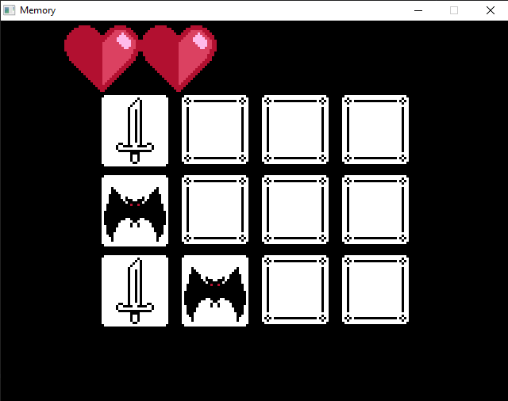

# Memory in SDL3

This is a simple Memory game with creepy themes.

It is developed with Simple DirectMedia Layer (SDL3).

All used assets are made by me.

### License
The source code is open source, but all game assets (art, audio, music) are proprietary and may not be reused.
